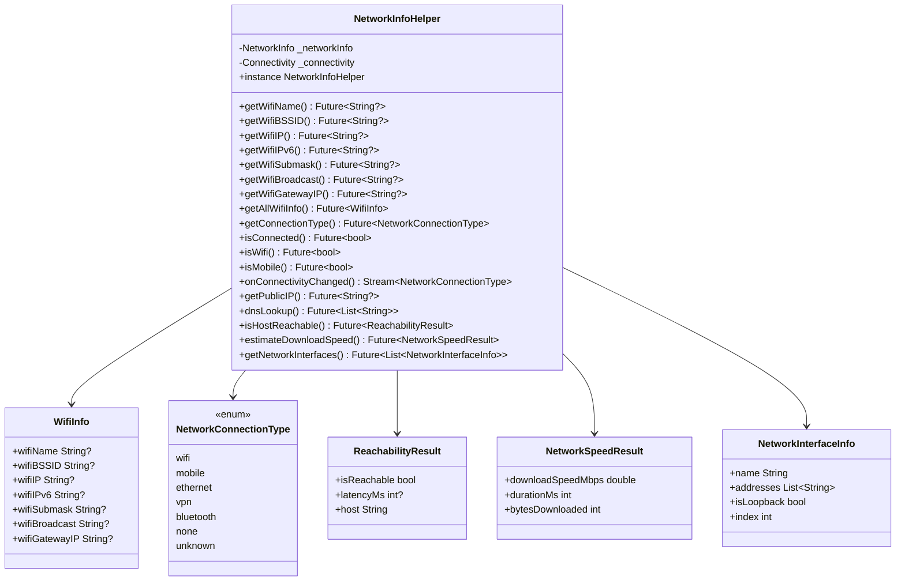

# Add Network Info Helper (Expanded)

## Overview

Create a comprehensive `NetworkInfoHelper` that wraps `network_info_plus` and `connectivity_plus` packages, plus pure Dart utilities for DNS lookup, reachability, public IP, speed estimation, and network interface listing. Not supported on web.

## Architecture




## Dependencies


| Need         | Package                     | Notes                                         |
| ------------ | --------------------------- | --------------------------------------------- |
| WiFi info    | `network_info_plus: ^7.0.0` | WiFi name, BSSID, IP, gateway, etc.           |
| Connectivity | `connectivity_plus: ^6.1.4` | Connection type, online status, change stream |
| Public IP    | `dio` (already exists)      | HTTP GET to `https://api.ipify.org`           |
| DNS lookup   | `dart:io` (built-in)        | `InternetAddress.lookup()`                    |
| Reachability | `dart:io` (built-in)        | `Socket.connect()` with timeout               |
| Speed test   | `dio` (already exists)      | Download a known file, measure throughput     |
| Interfaces   | `dart:io` (built-in)        | `NetworkInterface.list()`                     |


Only 2 new packages needed: `network_info_plus` and `connectivity_plus`. Everything else uses `dart:io` or the existing `dio` dependency.

## Files to Create/Modify

### 1. Add Dependencies

**File:** [pubspec.yaml](pubspec.yaml)

Add under `# System`:

```yaml
network_info_plus: ^7.0.0
connectivity_plus: ^6.1.4
```

### 2. Create NetworkInfoHelper

**File:** [lib/src/helper/network_info_helper.dart](lib/src/helper/network_info_helper.dart)

Singleton with the following method groups:

**WiFi Info** (via `network_info_plus`):

- `getWifiName()` -> `Future<String?>`
- `getWifiBSSID()` -> `Future<String?>`
- `getWifiIP()` -> `Future<String?>`
- `getWifiIPv6()` -> `Future<String?>`
- `getWifiSubmask()` -> `Future<String?>`
- `getWifiBroadcast()` -> `Future<String?>`
- `getWifiGatewayIP()` -> `Future<String?>`
- `getAllWifiInfo()` -> `Future<WifiInfo>` (batch call returning model)

**Connectivity** (via `connectivity_plus`):

- `getConnectionType()` -> `Future<NetworkConnectionType>` (maps ConnectivityResult to our enum)
- `isConnected()` -> `Future<bool>` (true if not `.none`)
- `isWifi()` -> `Future<bool>`
- `isMobile()` -> `Future<bool>`
- `onConnectivityChanged` -> `Stream<NetworkConnectionType>` (wraps connectivity stream)

**Public IP** (via `dio` + ipify API):

- `getPublicIP()` -> `Future<String?>` (GET `https://api.ipify.org?format=text`)

**DNS Lookup** (via `dart:io`):

- `dnsLookup(String host)` -> `Future<List<String>>` (uses `InternetAddress.lookup()`)

**Reachability** (via `dart:io` Socket):

- `isHostReachable(String host, {int port = 80, Duration timeout = 5s})` -> `Future<ReachabilityResult>` (Socket.connect with stopwatch for latency)

**Speed Estimation** (via `dio`):

- `estimateDownloadSpeed({String? testUrl})` -> `Future<NetworkSpeedResult>` (downloads a small file, measures bytes/time, calculates Mbps)

**Network Interfaces** (via `dart:io`):

- `getNetworkInterfaces()` -> `Future<List<NetworkInterfaceInfo>>` (uses `NetworkInterface.list()`)

**Platform check**: All methods check `kIsWeb` first and return safe defaults (null, false, empty list) with a debug log. No `dart:io` import on web.

### 3. Create Model Classes

Same file or separate models file:

- `WifiInfo` - all WiFi fields as nullable strings
- `NetworkConnectionType` enum - `wifi`, `mobile`, `ethernet`, `bluetooth`, `vpn`, `none`, `unknown`
- `ReachabilityResult` - `isReachable`, `latencyMs`, `host`
- `NetworkSpeedResult` - `downloadSpeedMbps`, `durationMs`, `bytesDownloaded`
- `NetworkInterfaceInfo` - `name`, `addresses`, `isLoopback`, `index`

### 4. Export Helper

**File:** [lib/masterfabric_core.dart](lib/masterfabric_core.dart)

- Add: `export 'package:masterfabric_core/src/helper/network_info_helper.dart';`

### 5. Create Example State

**File:** [example/lib/views/helpers/network_info/cubit/network_info_state.dart](example/lib/views/helpers/network_info/cubit/network_info_state.dart)

Fields grouped by section:

- Loading/error flags
- WiFi fields (from `WifiInfo`)
- Connection type, isConnected
- Public IP
- DNS results (host + resolved IPs)
- Reachability result
- Speed result
- Interface list
- `isWebPlatform` flag

### 6. Create Example Cubit

**File:** [example/lib/views/helpers/network_info/cubit/network_info_cubit.dart](example/lib/views/helpers/network_info/cubit/network_info_cubit.dart)

Methods:

- `loadNetworkInfo()` - loads WiFi info + connectivity + interfaces
- `fetchPublicIP()` - gets public IP
- `runDnsLookup(String host)` - resolves a hostname
- `checkReachability(String host)` - pings a host
- `runSpeedTest()` - estimates download speed

### 7. Create Example View

**File:** [example/lib/views/helpers/network_info/network_info_view.dart](example/lib/views/helpers/network_info/network_info_view.dart)

Sections displayed as cards in a ListView:

- **WiFi Info** card - name, BSSID, IP, IPv6, submask, broadcast, gateway
- **Connectivity** card - connection type, isConnected badge
- **Public IP** card - fetched public IP with refresh button
- **DNS Lookup** card - text field for hostname, button to resolve, results list
- **Reachability** card - text field for host, check button, latency result
- **Speed Test** card - button to run, progress indicator, speed in Mbps
- **Network Interfaces** card - list of interfaces with name and addresses

Web platform: Show banner "Network info is not supported on web"

### 8. Add Route

**File:** [example/lib/app/routes.dart](example/lib/app/routes.dart)

- Route: `static const String networkInfoCases = '/helpers/network-info';`
- GoRoute entry with `NetworkInfoView`

### 9. Add to Helpers Hub

**File:** [example/lib/views/helpers/helpers_hub_view.dart](example/lib/views/helpers/helpers_hub_view.dart)

- Entry: `_Helper('Network Info', 'network_info_plus + connectivity_plus', LucideIcons.wifi, ...)`

## Platform Support

- **Android/iOS/macOS/Linux/Windows**: Full support for all methods
- **Web**: Not supported. All methods return safe defaults (null/false/empty). UI shows "Not supported on web" banner.
- WiFi name/BSSID requires location permission on Android/iOS
- iOS simulators return null for WiFi info

