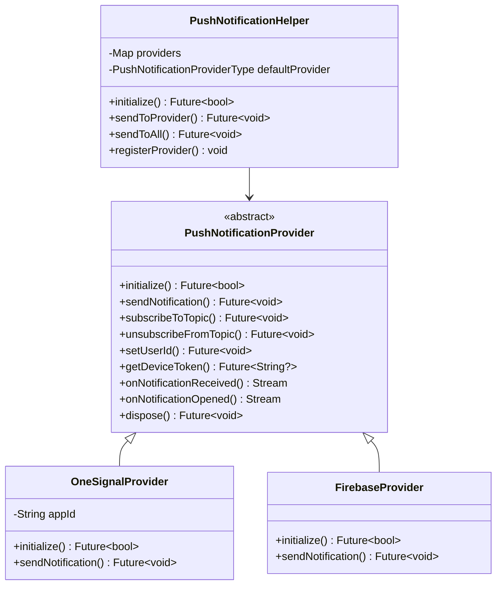

# Push Notification Helper Implementation

## Architecture Overview



## File Structure

```
lib/src/helper/push_notification_helper/
├── abstract/
│   └── push_notification_provider_base.dart    # Abstract base class
├── models/
│   └── push_notification_models.dart           # Data models
├── providers/
│   ├── onesignal_provider.dart                 # OneSignal implementation
│   └── firebase_provider.dart                  # FCM implementation
└── push_notification_helper.dart               # Unified helper
```

## Key Files to Create

### 1. Abstract Base - `push_notification_provider_base.dart`

Define the contract for all notification providers:

- `initialize()` - Setup provider with config
- `sendNotification()` - Send push notification
- `subscribeToTopic()` / `unsubscribeFromTopic()` - Topic management
- `setUserId()` / `setExternalUserId()` - User identification
- `getDeviceToken()` - Get push token
- `onNotificationReceived` - Stream for received notifications
- `onNotificationOpened` - Stream for opened notifications

### 2. Models - `push_notification_models.dart`

```dart
enum PushNotificationProviderType { onesignal, firebase, custom }

class PushNotificationData {
  final String? title;
  final String? body;
  final Map<String, dynamic>? additionalData;
  final PushNotificationProviderType source;
}

class PushNotificationConfig {
  // OneSignal
  final String? oneSignalAppId;
  final bool oneSignalEnabled;
  // Firebase
  final bool firebaseEnabled;
  // General
  final PushNotificationProviderType defaultProvider;
  final bool autoInitialize;
}
```

### 3. OneSignal Provider - `onesignal_provider.dart`

Implements `PushNotificationProviderBase` using `onesignal_flutter: ^5.3.5`:

- Initialize with appId from config
- Handle permission requests
- Subscribe/unsubscribe topics
- Set external user ID
- Stream notification events

### 4. Firebase Provider - `firebase_provider.dart`

Implements `PushNotificationProviderBase` using `firebase_messaging`:

- Initialize Firebase app
- Request permissions
- Handle foreground/background messages
- Topic subscription
- Token management

### 5. Unified Helper - `push_notification_helper.dart`

Singleton pattern (matching existing helpers like [permission_handler_helper.dart](lib/src/helper/permission_handler_helper/permission_handler_helper.dart)):

- Register/unregister providers dynamically
- Initialize providers based on app_config
- Send to specific provider or broadcast to all
- Unified notification stream combining all providers
- Factory method for easy provider registration

## Configuration in app_config.json

Add new section to [app_config.json](assets/app_config.json):

```json
"pushNotificationConfiguration": {
  "enabled": true,
  "defaultProvider": "onesignal",
  "autoInitialize": true,
  "providers": {
    "onesignal": {
      "enabled": true,
      "appId": "YOUR_ONESIGNAL_APP_ID"
    },
    "firebase": {
      "enabled": false
    }
  }
}
```

## Dependencies to Add

Add to [pubspec.yaml](pubspec.yaml):

- `onesignal_flutter: ^5.3.5`
- `firebase_core: ^latest`
- `firebase_messaging: ^latest`

## Extensibility for Future Providers

The Strategy pattern allows adding new providers by:

1. Creating a new class implementing `PushNotificationProviderBase`
2. Registering it with `PushNotificationHelper.registerProvider()`
3. Adding config in `pushNotificationConfiguration.providers`

No changes needed to existing code - fully open for extension, closed for modification.