<div align="center">

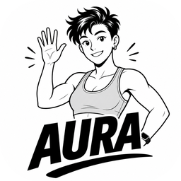

# AURA

**Local fitness tracker & coach**

A product demonstration built exclusively on [`masterfabric_core`](../)

<br />

[](https://masterfabric.co)
[](./LICENSE)
[](#)
[](#internationalization)

<br />


<p>
  Black–white · borderless · on-device · illustration-led<br />
  Onboarding → permissions → Today · Log · Body · Coach
</p>

</div>

---

<div align="center">

## Overview

</div>

AURA is a **reference consumer product** for the MasterFabric Flutter stack. It shows how a full fitness coach experience can be assembled from core patterns alone — `MasterApp`, `MasterViewCubit`, config-driven theme, slang i18n, local storage, permissions, widgets, and jobs — without a separate design-system package or a remote backend for the daily loop.

| | |
|:--|:--|
| **Product** | AURA (`example_v2`) |
| **Owner** | MASTERFABRIC Bilişim Teknoloji A.Ş. ([masterfabric.co](https://masterfabric.co)) |
| **Author** | Gürkan Fikret Günak ([@gurkanfikretgunak](https://github.com/gurkanfikretgunak)) |
| **Platforms** | iOS 15+ · Android · optional Widget / Live Activity / Watch |
| **License** | [AGPLv3 + AURA additional terms](./LICENSE) |
| **Privacy** | All personal data stays on device |

**What you get in this package**

1. **Architectural fidelity** — screens extend `MasterViewCubit`; the shell boots through `MasterApp`.
2. **Shared chrome** — `AuraKit` / `AuraSpace` wrap core spacers so views do not invent one-off gaps.
3. **Config-first UI** — `assets/app_config.json` → `AuraThemeConfig` (theme mode, font scale, developer overlays).
4. **Bilingual copy** — slang `en` + `tr` with a language switcher in the profile sheet.
5. **Local-first coaching** — BMI / BMR / TDEE, food & burn logging, tip cards, local activity jobs; WebLLM coaching on a real iPhone.

Screenshots below were captured on an **iPhone 17** simulator via Flutter `integration_test`.

---

<div align="center">

## License & commercial use

</div>

AURA is **owned by MASTERFABRIC**. Source is released under the **GNU Affero General Public License v3** with product-specific terms in [`LICENSE`](./LICENSE).

| Use case | Requirement |
|:--|:--|
| Study, fork, AGPL-compliant use | AGPLv3 + MasterFabric root terms + AURA terms |
| Commercial / SaaS / white-label / paid store apps | **Paid commercial license** → [license@masterfabric.co](mailto:license@masterfabric.co) |
| Verified non-profit | Free-license codes on request (same contact) |
| Brand & illustrations | No endorsement without written permission |

Do not remove MasterFabric or AURA ownership notices from the app, this README, or license files.

---

<div align="center">

## Product surface

</div>

| Area | What it does |
|:--|:--|
| **Onboarding** | Welcome → sex → body metrics → body type → training goal → ready |
| **Permissions** | Intro → notifications → location → fitness → ready |
| **Today** | Remaining calories, macros, warnings, quick water / food / burn |
| **Log** | Presets + custom food, drink, and burn entries |
| **Body** | Height, weight, age, sex, activity → BMI / BMR / TDEE / goal |
| **Coach** | Daily assist, tip guides, journal, local reminder toggles |
| **Profile** | Baseline summary + **English / Turkish** language switcher |

---

<div align="center">

## Architecture

</div>

```text
example_v2/
├── assets/
│   ├── app_config.json            # MasterApp + AuraThemeConfig
│   ├── i18n/{en,tr}.i18n.json     # slang product strings
│   ├── icons/app_icon_1024.png    # source marketing icon
│   ├── illustrations/             # onboarding, tips, log, brand
│   ├── notifications/             # local job / notification JSON
│   └── webllm/                    # on-device coach HTML shell
├── lib/
│   ├── app/                       # bootstrap, DI, theme config
│   ├── data/models/               # food, weight, notifications, …
│   ├── jobs/                      # local activity nudges
│   ├── platform/                  # widget / watch bridges
│   ├── views/                     # onboarding + tab screens (+ cubits)
│   ├── widgets/                   # AuraKit, AuraShell, tips, toasts
│   └── src/resources/             # generated slang (dart run slang)
├── ios/                           # Runner + AuraWidget + AuraWatch
├── docs/
│   ├── brand/                     # rounded icon + wordmark for docs
│   └── screenshots/               # capture set (01–18)
└── LICENSE                        # AGPLv3 notice + commercial terms
```

**Dependency rule:** product UI sits on **`masterfabric_core` only** (plus Flutter SDK helpers, `permission_handler`, and slang). There is no second UI framework.

| Concern | Mechanism |
|:--|:--|
| App shell | `MasterApp` (`lib/app/app.dart`) |
| Screens | `MasterViewCubit` / `BaseViewModelCubit` |
| Spacing & chrome | `AuraKit` + `AuraSpace` → core spacers |
| Theme | `uiConfiguration` → `AuraThemeConfig` |
| i18n | slang `en` / `tr` → `lib/src/resources/` (imported as `aura`) |
| Persistence | `LocalStorageHelper` / Hive CE via core storage config |
| Apple extras | Home Widget, Live Activity, Watch under `ios/` |

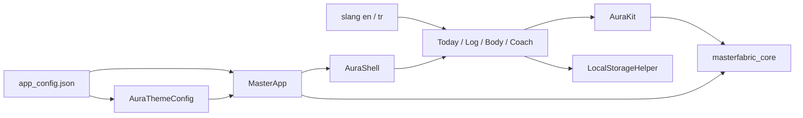

---

<div align="center">

## Screenshots

<p>iPhone 17 simulator · rounded frames match the app-icon treatment</p>

</div>

### Launch & onboarding

<div align="center">
  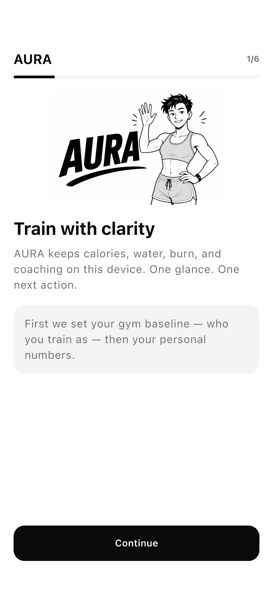
  &nbsp;
  
  <br /><br />
  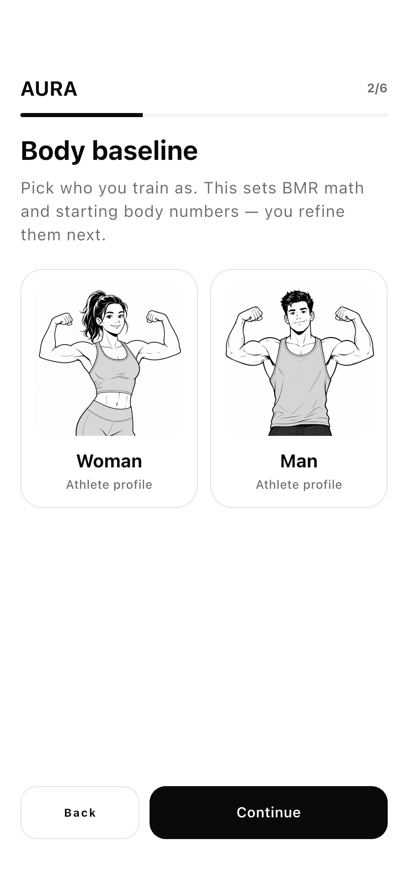
  &nbsp;
  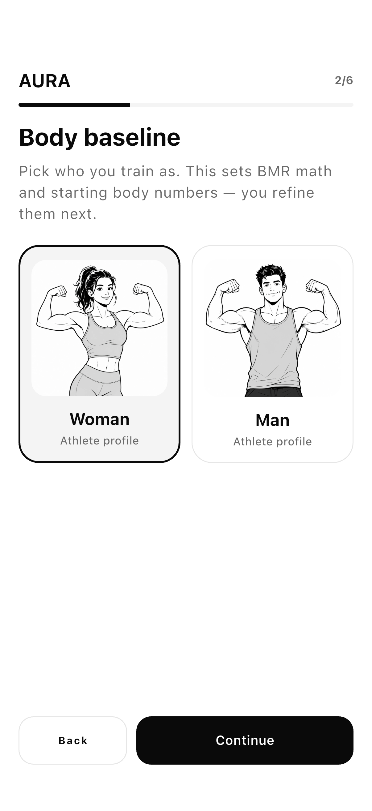
  <br /><br />
  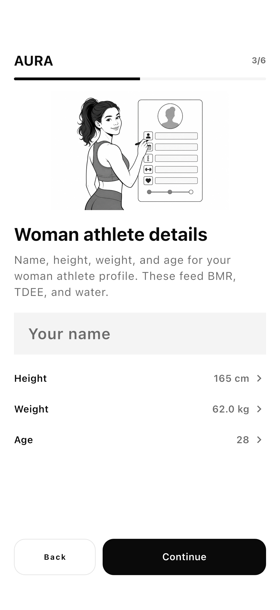
  &nbsp;
  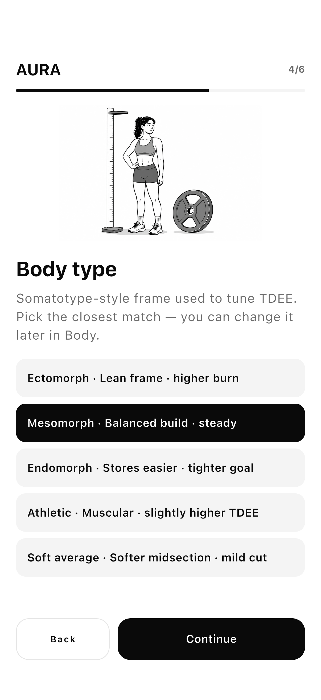
  <br /><br />
  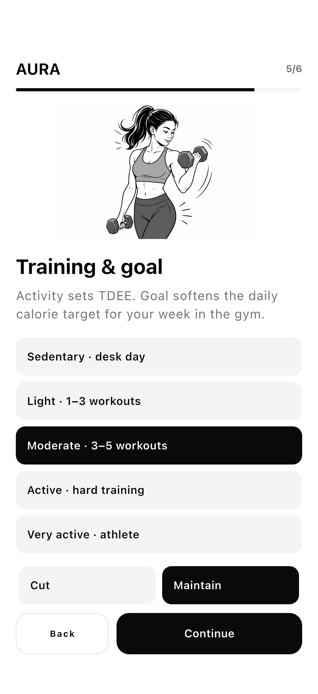
  &nbsp;
  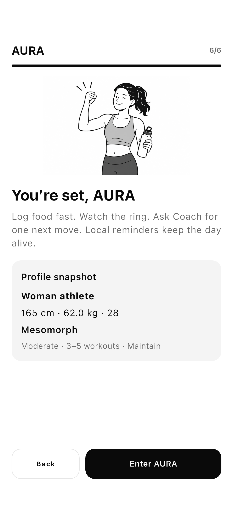
</div>

### Permissions

<div align="center">
  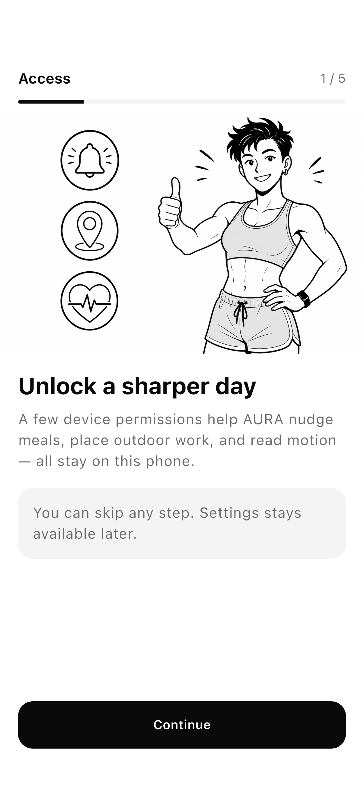
  &nbsp;
  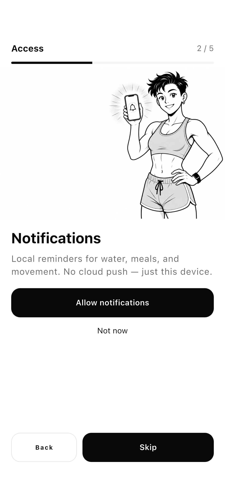
  <br /><br />
  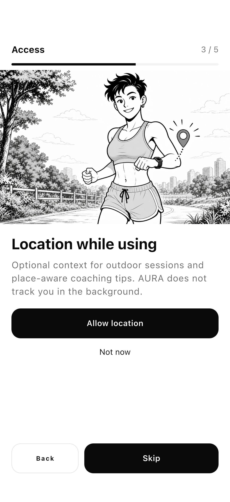
  &nbsp;
  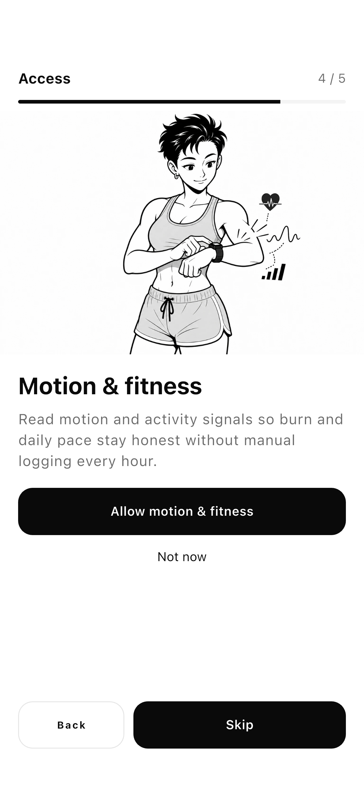
  <br /><br />
  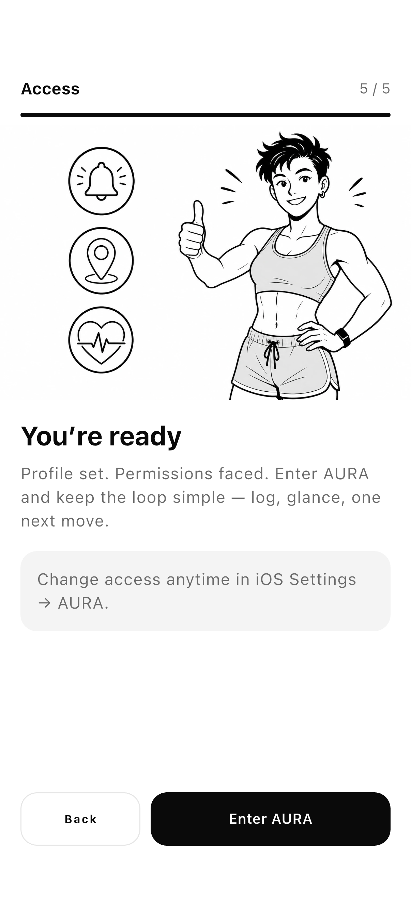
</div>

### Main tabs & profile

<div align="center">
  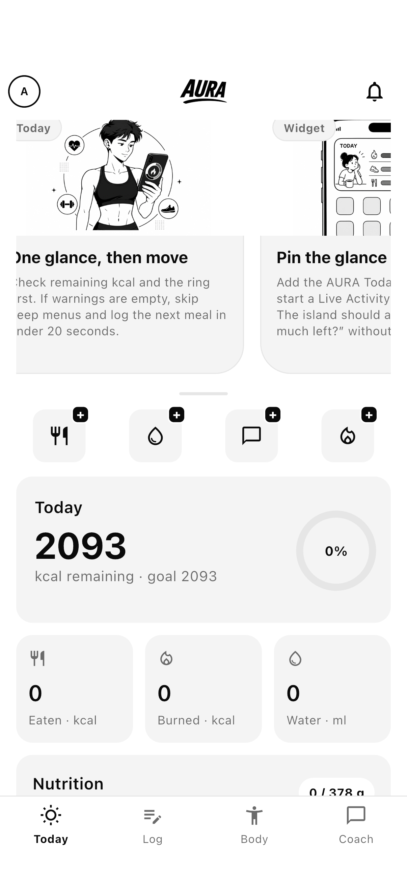
  &nbsp;
  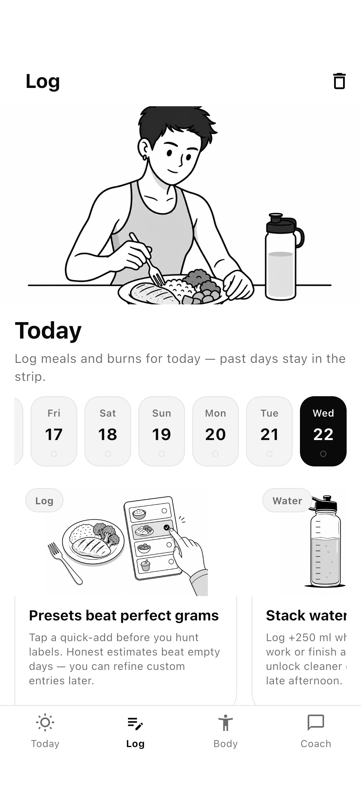
  <br /><br />
  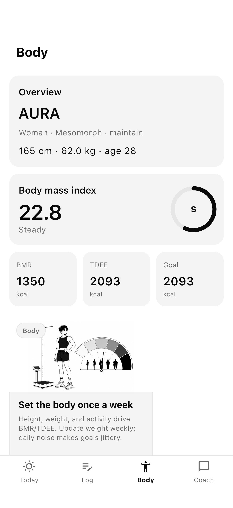
  &nbsp;
  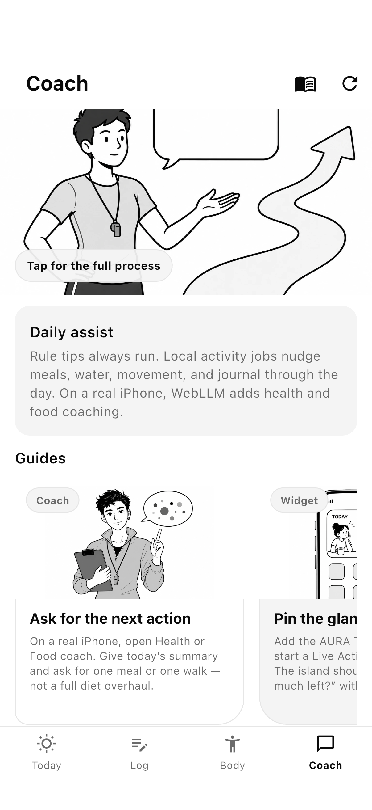
  <br /><br />
  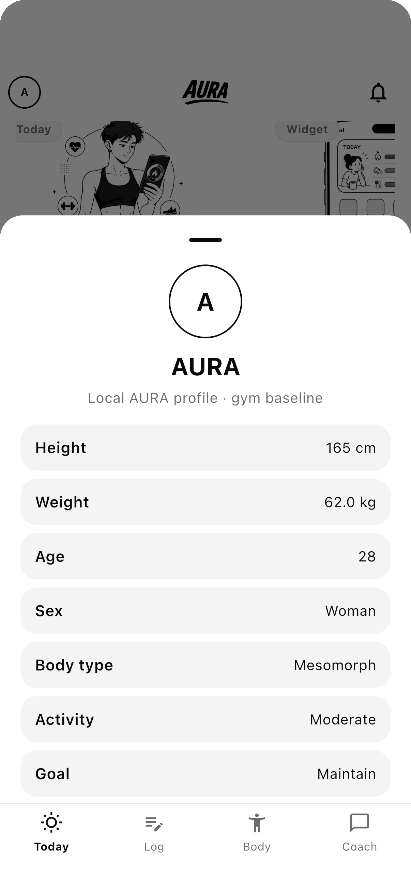
</div>

---

<div align="center">

## Internationalization

</div>

Supported locales: **English (`en`)** and **Turkish (`tr`)**.

```bash
# Edit
#   assets/i18n/en.i18n.json
#   assets/i18n/tr.i18n.json

cd example_v2
dart run slang
```

Generated output lives in `lib/src/resources/resources*.g.dart`.  
App code imports slang as `import '.../resources.g.dart' as aura;` so it does not collide with `masterfabric_core`’s own `LocaleSettings` / `Translations`.

Defaults are also declared in `app_config.json` → `localizationConfiguration`.

---

<div align="center">

## Theme configuration

</div>

`assets/app_config.json` → `uiConfiguration` drives:

| Key | Effect |
|:--|:--|
| `themeMode` | `light` / `dark` / system via `AuraThemeConfig.themeMode()` |
| `fontScale` | Global text scale into `MasterApp` |
| `devModeGrid` / `devModeSpacer` | Core developer overlays |

Splash, feature flags, storage (`hiveCe`), and navigation defaults share the same file so the product stays **config-first**.

---

<div align="center">

## Run

</div>

```bash
cd example_v2
flutter pub get
dart run slang          # after editing i18n JSON
flutter run
```

**Requirements:** Flutter ≥ 3.44 · Dart SDK ^3.12 · iOS 15+

Optional Apple targets: Home Widget (`AuraWidget`), Live Activity, Watch (`AuraWatch`) — see `ios/`.

App icon source: `assets/icons/app_icon_1024.png` and iOS `AppIcon.appiconset` (marketing 1024 used for `docs/brand/app_icon.png` with iOS-style corner radius).

---

<div align="center">

## Regenerating screenshots

</div>

| Driver | Coverage |
|:--|:--|
| `integration_test/aura_screenshots_test.dart` | Launch → onboarding → permissions |
| `integration_test/aura_tabs_screenshots_test.dart` | Today / Log / Body / Coach / profile (`14`–`18`) |
| `test_driver/integration_test.dart` | Writes PNGs under `docs/screenshots/` |

```bash
cd example_v2
flutter drive \
  --driver=test_driver/integration_test.dart \
  --target=integration_test/aura_tabs_screenshots_test.dart \
  -d <SIMULATOR_UDID>
```

Body baseline capture selects **Woman** before Continue so validation does not block the flow.

After a fresh capture, re-apply iOS-style corner masks on `docs/screenshots/*.png` (and rebuild `docs/brand/app_icon.png` from the iOS 1024 marketing icon) so GitHub renders rounded frames without relying on CSS alone.

---

<div align="center">

## Relation to `masterfabric_core`

</div>

| Layer | Lives in |
|:--|:--|
| Reusable Flutter architecture (views, storage, config, spacers, slang patterns) | `masterfabric_core` |
| AURA product UX, illustrations, coach copy, jobs, shell widgets | `example_v2` (this package) |

Treat AURA as the **worked example** of shipping on the core — not as a second framework.

---

<div align="center">

## Contact

[license@masterfabric.co](mailto:license@masterfabric.co)
·
[masterfabric.co](https://masterfabric.co)
·
[`masterfabric_core`](../)

<br />

**© 2025–2026 MASTERFABRIC Bilişim Teknoloji A.Ş.**  
AURA is a MasterFabric product.

</div>
